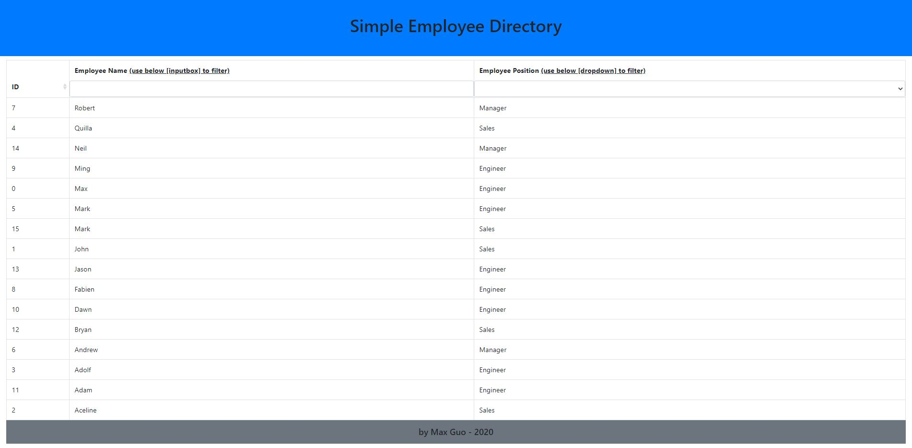

# BudgetTrackers

## Badges


## License

Copyright 2020 - Max Guo. Code released under the MIT license.

## User Story
```
As A USER, 
I want to be able to view my entire employee directory at once so that I have quick access to their information.
```
## Table of Content

* [Description](#Description)
* [Demo](#Demo)
* [Contributing](#Contributing)
* [Reference](#Reference)


## Description

An employee or manager would benefit greatly from being able to view non-sensitive data about other employees. 
User could filter table by Employee position and Employee name, User could sort table by ID.


## Demo


Demo Link : https://still-stream-00919.herokuapp.com/

## Contributing

Max, github:https://github.com/Maxguojiaqi

## Reference
Created using create-react-app: https://reactjs.org/docs/create-a-new-react-app.html#create-react-app
React reference: https://reactjs.org/ 